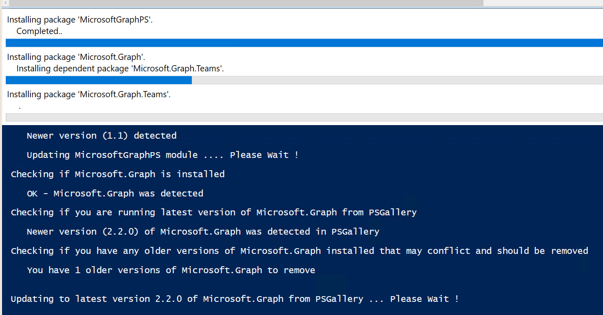
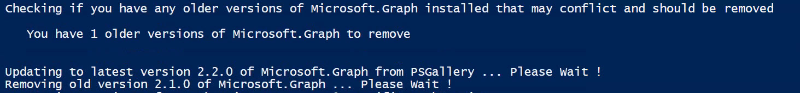
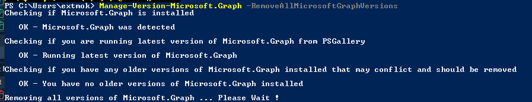

# MicrosoftGraphPS
I'm really happy to announce my newest PS-module, **MicrosoftGraphPS**.

Think of this PS-module as a helper for **Microsoft Graph version-management, connectivity** and **data management** using **Microsoft Graph**. It does also support **generic Microsoft REST API connectivity** and **data management** like https://api.securitycenter.microsoft.com/api/machines. Lastly, it includes new custom cmdlets I use often like Get-MgUser-AllProperties-AllUsers

| Function Name                      | Funtionality                                                 |
| ---------------------------------- | ------------------------------------------------------------ |
| Manage-Version-Microsoft.Graph     | Version management of Microsoft.Graph PS modules<br/>Installing latest version of Microsoft.Graph, if not found<br/>Shows older installed versions of Microsoft.Graph<br/>Checks if newer version if available from PSGallery of Microsoft.Graph<br/>Automatic clean-up old versions of Microsoft.Graph<br/>Update to latest version from PSGallery of Microsoft.Graph<br/>Remove all versions of Microsoft.Graph (complete re-install) |
| InstallUpdate-MicrosoftGraphPS     | Install latest version of MicrosoftGraphPS, if not found<br/>Update to latest version of MicrosoftGraphPS, if switch (-AutoUpdate) is set |
| Connect-MicrosoftGraphPS           | Connect to Microsoft Graph using Azure App & Secret<br/>Connect to Microsoft Graph using Azure App & Certificate Thumprint<br/>Connect to Microsoft Graph using interactive login and scope |
| Invoke-MgGraphRequestPS            | Invoke command with pagination support to get/put/post/patch/delete data using Microsoft Graph REST endpoint. |
| Connect-MicrosoftRestApiEndpointPS | Connect to REST API endpoint like https://api.securitycenter.microsoft.com using Azure App & Secret |
| Invoke-MicrosoftRestApiRequestPS   | Invoke command to get/put/post/patch/delete data using Microsoft REST API endpoint<br/>Get data using Microsoft REST API endpoint like <br/>https://api.securitycenter.microsoft.com/api/machines |
| Get-MgUser-AllProperties-AllUsers  | Get all properties for all users<br/>Expands manager information<br/>Excludes certain properties which cannot be returned within a user collection in bulk retrieval<br/><br/>The following properties are only supported when retrieving a single user: aboutMe, birthday, hireDate, interests, mySite, pastProjects, preferredName, <br/>responsibilities, schools, skills, mailboxSettings, DeviceEnrollmentLimit, print, SignInActivity |


## Download of MicrosoftGraphPS

You can [find MicrosoftGraph here](https://raw.githubusercontent.com/KnudsenMorten/MicrosoftGraphPS/main/MicrosoftGraphPS.psm1) - or from [Powershell Gallery using this link](https://www.powershellgallery.com/packages/MicrosoftGraphPS)


## Version Management of MicrosoftGraphPS & Microsoft.Graph


#### Install / Update MicrosoftGraphPS (pre-req to get access to functions)

Just copy the entire script-code below into the beginning of your script - and change the variables according to your needs as outlined below.


<details>
  <summary><h4>Complete Script / Powershell code</h4></summary>

```
##########################################################################################
# Pre-req script for getting environment ready with Microsoft.Graph and MicrosoftGraphPS
##########################################################################################

<#
.SYNOPSIS
Install and Update MicrosoftGraphPS module
Version management of Microsoft.Graph PS modules

.DESCRIPTION

MicrosoftGraphPS:
 Install latest version of MicrosoftGraphPS, if not found
 Updates to latest version of MicrosoftGraphPS, if switch ($AutoUpdate) is set to $True

Microsoft.Graph:
 Installing latest version of Microsoft.Graph, if not found
 Shows older installed versions of Microsoft.Graph
 Checks if newer version if available from PSGallery of Microsoft.Graph
 Automatic clean-up old versions of Microsoft.Graph
 Update to latest version from PSGallery of Microsoft.Graph

.AUTHOR
Morten Knudsen, Microsoft MVP - https://mortenknudsen.net

.LINK
https://github.com/KnudsenMorten/MicrosoftGraphPS
#>

# Variables
$Scope      = "AllUsers"  # Valid parameters: AllUsers, CurrentUser
$AutoUpdate = $True

# Check if MicrosoftGraphPS is installed
$ModuleCheck = Get-Module -Name MicrosoftGraphPS -ListAvailable -ErrorAction SilentlyContinue

If (!($ModuleCheck))    # MicrosoftGraphPS is NOT installed
    {
        # check for NuGet package provider
        [Net.ServicePointManager]::SecurityProtocol = [Net.SecurityProtocolType]::Tls12

        Write-host ""
        Write-host "Checking Powershell PackageProvider NuGet ... Please Wait !"
            if (Get-PackageProvider -ListAvailable -Name NuGet -ErrorAction SilentlyContinue -WarningAction SilentlyContinue) 
                {
                    Write-host ""
                    Write-Host "OK - PackageProvider NuGet is installed"
                } 
            else 
                {
                    try
                        {
                            Write-host ""
                            Write-Host "Installing NuGet package provider .. Please Wait !"
                            Install-PackageProvider -Name NuGet -Scope $Scope -Confirm:$false -Force
                        }
                    catch [Exception] {
                        $_.message 
                        exit
                    }
                }

        Write-host "Powershell module MicrosoftGraphPS was not found !"
        Write-Host ""
        Write-host "Installing latest version from PsGallery in scope $Scope .... Please Wait !"
        Write-Host ""

        Install-module -Name MicrosoftGraphPS -Repository PSGallery -Force -Scope $Scope
        import-module -Name MicrosoftGraphPS -Global -force -DisableNameChecking -WarningAction SilentlyContinue
    }
        
Elseif ($ModuleCheck)    # MicrosoftGraphPS is installed - checking version, if it should be updated
    {
        # sort to get highest version, if more versions are installed
        $ModuleCheck = Sort-Object -Descending -Property Version -InputObject $ModuleCheck
        $ModuleCheck = $ModuleCheck[0]

        Write-host "Checking latest version of MicrosoftGraphPS module at PsGallery"
        $online = Find-Module -Name MicrosoftGraphPS -Repository PSGallery

        #compare versions
        if ( ([version]$online.version) -gt ([version]$ModuleCheck.version) ) 
            {
                write-host ""
                Write-host "   Newer version ($($online.version)) detected"

                If ($AutoUpdate -eq $true)
                    {
                        write-host ""
                        Write-host "   Updating MicrosoftGraphPS module .... Please Wait !"
                        Write-Host ""

                        Update-module -Name MicrosoftGraphPS -Force
                        import-module -Name MicrosoftGraphPS -Global -force -DisableNameChecking -WarningAction SilentlyContinue
                    }
            }
        else
            {
                # No new version detected ... continuing !
                write-host ""
                Write-host "   OK - Running latest version of MicrosoftGraphPS"
                Write-Host ""

                $UpdateAvailable = $False
                import-module -Name MicrosoftGraphPS -Global -force -DisableNameChecking -WarningAction SilentlyContinue
            }
    }

##########################################################################################
# Install-Update-Cleanup-Microsoft.Graph
##########################################################################################
If ($AutoUpdate)
    {
        Manage-Version-Microsoft.Graph -InstallLatestMicrosoftGraph -CleanupOldMicrosoftGraphVersions -Scope $Scope
    }
Else
    {
        Manage-Version-Microsoft.Graph -Scope $Scope
    }
```

</details>


You can also [download the script here](https://raw.githubusercontent.com/KnudsenMorten/MicrosoftGraphPS/main/Install-Update-MicrosoftGraphPS-Microsoft.Graph.ps1). 

You can run the pre-req code as part of your script and it will be able to update to latest version and remove old versions, if desired.


#### Daily Automatic Update - can be used in a scheduled task

```
C:\Windows\System32\WindowsPowerShell\v1.0\powershell.exe -executionpolicy bypass -file .\Install-Update-MicrosoftGraphPS-Microsoft.Graph.ps1
```


#### **Updating Microsoft Graph to latest version**

```
# Show details, install latest (if found) and clean-up old versions (if found)
Manage-Version-Microsoft.Graph -InstallLatestMicrosoftGraph -Scope AllUsers
```




#### **Clean-up older Microsoft Graph versions (except the latest available version)**

```
# Show details, install latest (if found) and clean-up old versions (if found)
Manage-Version-Microsoft.Graph -CleanupOldMicrosoftGraphVersions
```




#### **Remove all Microsoft Graph versions**

```
Manage-Version-Microsoft.Graph -RemoveAllMicrosoftGraphVersions
```




## MgGraph: Connectivity to Microsoft Graph using MicrosoftGraphPS


#### MgGraph: Connectivity with App & Secret

```
# Microsoft Graph connect with AzApp & CertificateThumprint
Connect-MicrosoftGraphPS -AppId $global:HighPriv_Modern_ApplicationID_Azure `
                         -Secret $global:HighPriv_Modern_Application_Secret_Azure `
                         -TenantId $global:AzureTenantID

Output:
Connecting to Microsoft Graph using Azure App & Secret
Welcome To Microsoft Graph!                         
```


#### MgGraph: Connectivity with App & CertificateThumbprint

```
# Microsoft Graph connect with AzApp & CertificateThumprint
Connect-MicrosoftGraphPS -AppId $global:HighPriv_Modern_ApplicationID_Azure `
                         -CertificateThumbprint $global:HighPriv_Modern_CertificateThumbprint_Azure `
                         -TenantId $global:AzureTenantID

Output:
Connecting to Microsoft Graph using Azure App & CertificateThumprint
Welcome To Microsoft Graph!                         
```


#### MgGraph: Connectivity using interactive login and scopes

```
# Microsoft Graph connect with interactive login with the permission defined in the scopes
$Scopes = @("DeviceManagementConfiguration.ReadWrite.All",`
            "DeviceManagementManagedDevices.ReadWrite.All",`
            "DeviceManagementServiceConfig.ReadWrite.All"
            )
Connect-MicrosoftGraphPS -Scopes $Scopes
```


#### MgGraph: Show permissions in the current context

```
# Show Permissions in the current context
Connect-MicrosoftGraphPS -ShowMgContextExpandScopes

Output:
Agreement.ReadWrite.All
TeamSettings.ReadWrite.All
CustomSecAttributeDefinition.ReadWrite.All
SecurityAlert.ReadWrite.All
TeamMember.Read.All
```


#### MgGraph: Show context of current Microsoft Graph context

```
# Show context of current Microsoft Graph context
Connect-MicrosoftGraphPS -ShowMgContext

Output:
ClientId               : 9283fsssssssss9a4f-2a9b521c91f9
TenantId               : be2sssssssssa6-ae25-9b9db2c9061b
Scopes                 : {Agreement.ReadWrite.All, TeamSettings.ReadWrite.All, CustomSecAttributeDefinition.ReadWrite.All, SecurityAlert.ReadWrite.Al
                         l...}
AuthType               : AppOnly
TokenCredentialType    : ClientSecret
CertificateThumbprint  : 
CertificateSubjectName : 
Account                : 
AppName                : xxxxxx - Automation - Azure
ContextScope           : Process
Certificate            : 
PSHostVersion          : 5.1.17763.4644
ManagedIdentityId      : 
ClientSecret           : System.Security.SecureString
Environment            : Global
```


## MgGraph: Get data from Microsoft Graph using 2 methods: MgGraph REST endpoint or MgGraph Cmdlets (if available)


#### MgGraph - Method 1: Invoke-MgGraphRequestPS GET with REST endpoint (supports pagination)

```
$Uri        = "https://graph.microsoft.com/v1.0/devicemanagement/managedDevices"
$Devices    = Invoke-MgGraphRequestPS -Uri $Uri -Method GET -OutputType PSObject
```


#### MgGraph - Method 2 (prefered): MgGraph Cmdlets (if available)

```
$Devices = Get-MgDeviceManagementManagedDevice
```


## REST API: Connectivity to Microsoft REST API Endpoint using MicrosoftGraphPS


#### REST API: Connectivity with App & Secret

```
$ConnectAuth = Connect-MicrosoftRestApiEndpointPS -AppId $global:HighPriv_Modern_ApplicationID_O365 `
                                                  -AppSecret $global:HighPriv_Modern_Secret_O365 `
                                                  -TenantId $global:AzureTenantID `
                                                  -Uri "https://api.securitycenter.microsoft.com"                        
```


## REST API: Get data from REST API using MicrosoftGraphPS


#### Get data from REST API like Defender for Endpoint (securitycenter api)

```
Invoke-MicrosoftRestApiRequestPS -Uri "https://api.securitycenter.microsoft.com/api/machines" `
                                 -Method GET `
                                 -Headers $ConnectAuth[1]
```


## Get-MgUser-AllProperties-AllUsers

Get all properties for all users
Expands manager information
Excludes certain properties which cannot be returned within a user collection in bulk retrieval (*)

(*)
https://learn.microsoft.com/en-us/graph/api/user-list?view=graph-rest-1.0&tabs=http#optional-query-parameters

The following properties are only supported when retrieving a single user: aboutMe, birthday, hireDate, interests, mySite, pastProjects, preferredName, 
responsibilities, schools, skills, mailboxSettings, DeviceEnrollmentLimit, print, SignInActivity

```
$Result = Get-MgUser-AllProperties-AllUsers
$Result | fl

Getting all properties from all users in Entra ID (prior named Azure AD) .... Please Wait !
```


# **Synopsis for functions**


## Manage-Version-Microsoft.Graph

```
.SYNOPSIS
Version management of Microsoft.Graph PS modules

.DESCRIPTION
Installing latest version of Microsoft.Graph, if not found
Shows older installed versions of Microsoft.Graph
Checks if newer version if available from PSGallery of Microsoft.Graph
Automatic clean-up old versions of Microsoft.Graph
Update to latest version from PSGallery of Microsoft.Graph
Remove all versions of Microsoft.Graph

.AUTHOR
Morten Knudsen, Microsoft MVP - https://mortenknudsen.net

.LINK
https://github.com/KnudsenMorten/MicrosoftGraphPS

.PARAMETER Scope
Scope where MicrosoftGraphPS module will be installed - can be AllUsers (default) or CurrentUser
        
.PARAMETER CleanupOldMicrosoftGraphVersions
[switch] Removes old versions, if any found

.PARAMETER RemoveAllMicrosoftGraphVersions
[switch] Removes all versions of Microsoft.Graph (complete re-install)

.PARAMETER InstallLatestMicrosoftGraph
[switch] Install latest version of Microsoft.Graph from PSGallery, if new version detected

.PARAMETER ShowVersionDetails
[switch] Show version details (detailed)

.INPUTS
None. You cannot pipe objects

.OUTPUTS
Returns the data

.EXAMPLE

# Show details of installed Microsoft.Graph
Manage-Version-Microsoft.Graph

# Show details of installed Microsoft.Graph including version details
Manage-Version-Microsoft.Graph -ShowVersionDetails

# Show details of installed Microsoft.Graph and install latest (if found)
Manage-Version-Microsoft.Graph -InstallLatestMicrosoftGraph

# Show details of installed Microsoft.Graph and install latest (if found)
Manage-Version-Microsoft.Graph -InstallLatestMicrosoftGraph -Scope CurrentUser

# Show details of installed Microsoft.Graph and clean-up old versions (if found)
Manage-Version-Microsoft.Graph -CleanupOldMicrosoftGraphVersions

# Show details of installed Microsoft.Graph and remove all versions (complete re-install)
Manage-Version-Microsoft.Graph -RemoveAllMicrosoftGraphVersions

# Show details, install latest (if found) and clean-up old versions (if found)
Manage-Version-Microsoft.Graph -InstallLatestMicrosoftGraph -CleanupOldMicrosoftGraphVersions
```


## InstallUpdate-MicrosoftGraphPS

```
.SYNOPSIS
Install and Update MicrosoftGraphPS module

.DESCRIPTION
Install latest version of MicrosoftGraphPS, if not found
Updates to latest version of MicrosoftGraphPS, if switch (-AutoUpdate) is set

.AUTHOR
Morten Knudsen, Microsoft MVP - https://mortenknudsen.net

.LINK
https://github.com/KnudsenMorten/MicrosoftGraphPS

.PARAMETER Scope
Scope where MicrosoftGraphPS module will be installed - can be AllUsers or CurrentUser

.PARAMETER AutoUpdate
MicrosoftGraphPS module will be updated to latest version, if switch (-AutoUpdate) is set

.INPUTS
None. You cannot pipe objects

.OUTPUTS
Installation / Update status

.EXAMPLE

InstallUpdate-MicrosoftGraphPS -Scope AllUsers -AutoUpdate
```


## Connect-MicrosoftGraphPS

    .SYNOPSIS
    Connect to Microsoft Graph (requires PS-module Microsoft Graph minimum v2.x)
        
    .DESCRIPTION
    Connect to Microsoft Graph using Azure App & Secret
    Connect to Microsoft Graph using Azure App & Certificate Thumprint
    Connect to Microsoft Graph using interactive login and scope
    
    .AUTHOR
    Morten Knudsen, Microsoft MVP - https://mortenknudsen.net
    
    .LINK
    https://github.com/KnudsenMorten/MicrosoftGraphPS
    
    .PARAMETER AppId
    This is the Azure app id
        
    .PARAMETER AppSecret
    This is the secret of the Azure app
    
    .PARAMETER TenantId
    This is the Azure AD tenant id
    
    .PARAMETER CertificateThumbprint
    This is the thumprint of the installed certificate
    
    .PARAMETER ShowMgContext
    switch to show the current Microsoft Graph context
    
    .PARAMETER ShowMgContextExpandScopes
    switch to show the Microsoft Graph permissions in the current context
    
    .PARAMETER Scopes
    Here you can define an array of permissions
    
    .INPUTS
    None. You cannot pipe objects
    
    .OUTPUTS
    Connection to Microsoft Graph ("welcome")
    
    .EXAMPLE
    
    # Microsoft Graph connect with AzApp & Secret
    Connect-MicrosoftGraphPS -AppId $global:HighPriv_Modern_ApplicationID_Azure `
                             -AppSecret $global:HighPriv_Modern_Secret_Azure `
                             -TenantId $global:AzureTenantID
    
    # Microsoft Graph connect with AzApp & CertificateThumprint
    Connect-MicrosoftGraphPS -AppId $global:HighPriv_Modern_ApplicationID_Azure `
                             -CertificateThumbprint $global:HighPriv_Modern_CertificateThumbprint_Azure `
                             -TenantId $global:AzureTenantID
    
    # Show Permissions in the current context
    Connect-MicrosoftGraphPS -ShowMgContextExpandScopes
    
    # Show context of current Microsoft Graph context
    Connect-MicrosoftGraphPS -ShowMgContext
    
    # Microsoft Graph connect with interactive login with the permission defined in the scopes
    $Scopes = @("DeviceManagementConfiguration.ReadWrite.All",`
                "DeviceManagementManagedDevices.ReadWrite.All",`
                "DeviceManagementServiceConfig.ReadWrite.All"
                )
    Connect-MicrosoftGraphPS -Scopes $Scopes


## Invoke-MgGraphRequestPS

    .SYNOPSIS
    Invoke command to get/put/post/patch/delete data using Microsoft Graph REST endpoint
    
    .DESCRIPTION
    Get data using Microsoft Graph REST endpoint in case there is no PS-cmdlet available
    
    .AUTHOR
    Morten Knudsen, Microsoft MVP - https://mortenknudsen.net
    
    .LINK
    https://github.com/KnudsenMorten/MicrosoftGraphPS
    
    .PARAMETER Uri
    This is the Uri for the REST endpoint in Microsoft Graph
    
    .PARAMETER Method
    This is the method to handle the data (GET, PUT, DELETE, POST, PATCH)
    
    .PARAMETER OutPutType
    This is the output type
    
    .INPUTS
    None. You cannot pipe objects
    
    .OUTPUTS
    Returns the data
    
    .EXAMPLE
    # Method #1 - REST Endpoint
    $Uri        = "https://graph.microsoft.com/v1.0/devicemanagement/managedDevices"
    $Devices    = Invoke-MgGraphRequestPS -Uri $Uri -Method GET -OutputType PSObject
    
    # Method #2 - MgGraph cmdlet (prefered method, if available)
    $Devices = Get-MgDeviceManagementManagedDevice
    $Devices


## Connect-MicrosoftRestApiEndpointPS

    .SYNOPSIS
    Connect to REST API endpoint
    
    .DESCRIPTION
    Connect to REST API endpoint like https://api.securitycenter.microsoft.com
    
    .AUTHOR
    Morten Knudsen, Microsoft MVP - https://mortenknudsen.net
    
    .LINK
    https://github.com/KnudsenMorten/MicrosoftGraphPS
    
    .PARAMETER Uri
    This is the Uri for the REST endpoint in Microsoft Graph
    
    .PARAMETER AppId
    This is the Azure app id
            
    .PARAMETER AppSecret
    This is the secret of the Azure app
    
    .PARAMETER TenantId
    This is the Azure AD tenant id
    
    .INPUTS
    None. You cannot pipe objects
    
    .OUTPUTS
    Connection Header & Token
    
    .EXAMPLE
    $ConnectAuth = Connect-MicrosoftRestApiEndpointPS -AppId $global:HighPriv_Modern_ApplicationID_O365 `
                                                      -AppSecret $global:HighPriv_Modern_Secret_O365 `
                                                      -TenantId $global:AzureTenantID `
                                                      -Uri "https://api.securitycenter.microsoft.com"


## Invoke-MicrosoftRestApiRequestPS

```
.SYNOPSIS
Invoke command to get/put/post/patch/delete data using Microsoft REST API endpoint

.DESCRIPTION
Get data using Microsoft REST API endpoint like GET https://api.securitycenter.microsoft.com/api/machines

.AUTHOR
Morten Knudsen, Microsoft MVP - https://mortenknudsen.net

.LINK
https://github.com/KnudsenMorten/MicrosoftGraphPS

.PARAMETER Uri
This is the Uri for the REST endpoint in Microsoft Graph

.PARAMETER Method
This is the method to handle the data (GET, PUT, DELETE, POST, PATCH)

.PARAMETER Header
This is the Header coming from Connect-MicrosoftRestApiEndpointPS

.INPUTS
None. You cannot pipe objects

.OUTPUTS
Returns the data

.EXAMPLE
$Result = Invoke-MicrosoftRestApiRequestPS -Uri "https://api.securitycenter.microsoft.com/api/machines" `
                                           -Method GET `
                                           -Headers $ConnectAuth[1]

# Show Result
$Result

```


## Get-MgUser-AllProperties-AllUsers

```
.SYNOPSIS
Performs a Get-MgUser for all users retrieving all properties (except for certain properties which cannot be returned within a user collection). 
Manager property is being expanded

.DESCRIPTION
Get all properties for all users
Expands manager information
Excludes certain properties which cannot be returned within a user collection in bulk retrieval (*)

(*)
https://learn.microsoft.com/en-us/graph/api/user-list?view=graph-rest-1.0&tabs=http#optional-query-parameters

The following properties are only supported when retrieving a single user: aboutMe, birthday, hireDate, interests, mySite, pastProjects, preferredName, 
responsibilities, schools, skills, mailboxSettings, DeviceEnrollmentLimit, print, SignInActivity

.AUTHOR
Morten Knudsen, Microsoft MVP - https://mortenknudsen.net

.LINK
https://github.com/KnudsenMorten/MicrosoftGraphPS

.INPUTS
None. You cannot pipe objects

.OUTPUTS
Returns the data

.EXAMPLE

$Result = Get-MgUser-AllProperties-AllUsers
$Result | fl

$Result.ManagerProperties | fl
```

